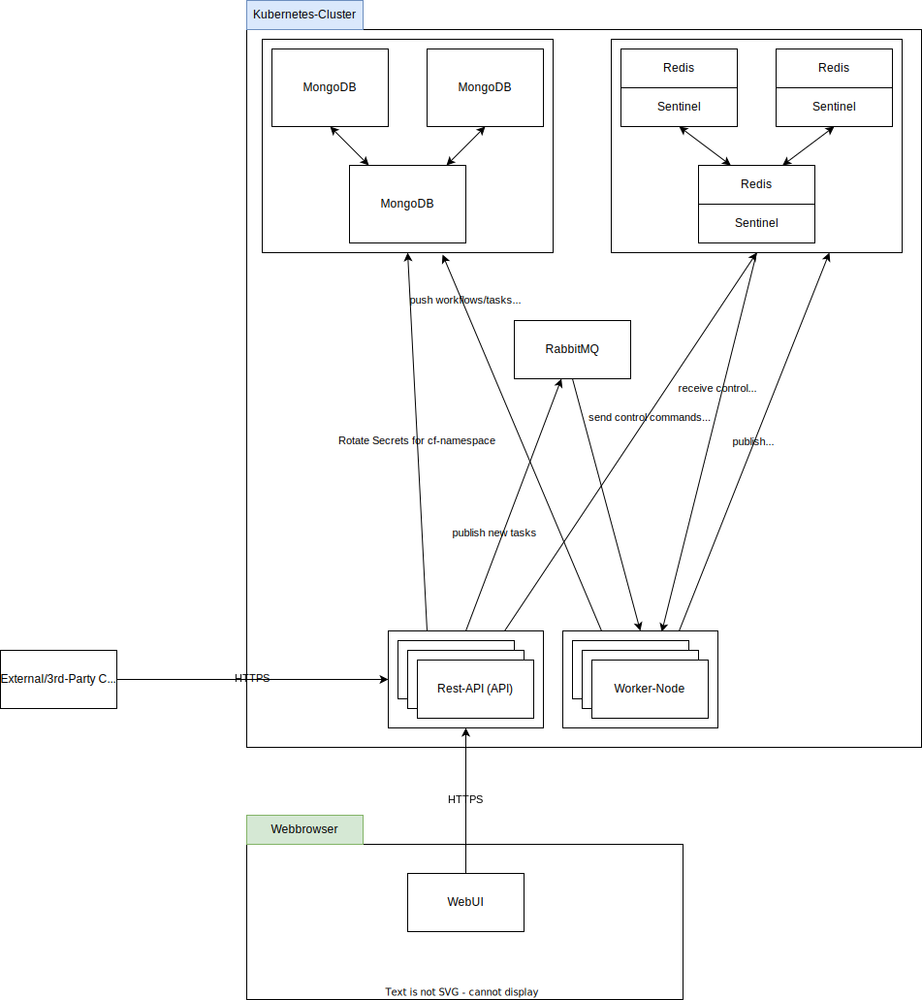

# chain-factory
Chain Factory master repository of the Chain Factory project

A framework to dispatch tasks fetched from an amqp queue to several worker nodes

## How to use

### components
 - Redis
 - RabbitMQ
 - MongoDB
 - api
 - worker_node
 - webui

### Backend
start the dev backend using the prepared docker-compose file

		docker-compose up -d

### worker node
To start a worker node you need to install the dependencies first and create a new directory with the workflows.

    pip install -r requirements.txt
		# copy the examples directory to the "worker"-directory
		cp -r framework/examples/ worker/
    # then start the worker node using
    python ./main_worker.py

If you are on a system with both python2 and python3 installed, you need to specify python3 instead of python as python on most systems is sym-linked with python2

## How to register new tasks to the worker node
To register new tasks to the worker node add either a new function together with the decorator

    @task_queue.task()
    def new_task():
        print('example')

Or register the task using the decorator and using an imported function in an external file e.g.

    # file1.py
    class ExampleClass():
        def example_task(self):
            print('example')
   
    # main.py
    from file1 import ExampleClass
    example_instance = ExampleClass()
    task_queue.task('example_task')(example_instance.example_task)

# Chain-Factory

## Architecture
### Reccomended Architecture

### Introduction
- Chain-Factory is per default installed on a kubernetes cluster. An example k3s cluster can be setup using the setup_k3s.sh script.
### Components
- MongoDB Cluster
	- The MongoDB Database Server/Cluster is the persistent storage used to store the persistent state of the cluster.
- Rabbitmq
	- The central broker, coordinating the distribution of tasks to the worker nodes.
	- In case of a disaster recovery, the tasks, if not saved, can be restarted using a script in scripts/restart_tasks.sh or by manually getting a list of not yet finished tasks in mongodb and publishing them again to the broker by keeping the existing workflow id.
- Redis
	- Redis is used to publish the heartbeat and enable the syncing of block lists.
	- As redis is only used for some small and fast data objects, the amount of memory needed. can be kept very small.
- Rest-API
	- The Rest-API is a http interface used to control the cluster.
	- The Rest-API documentation is available at `<rest-api-endpoint>/docs` e.g. `http://localhost:8000/docs`.
- Authentication-API
	- The Authentication-API is a container, which is written in golang, which enables the coupling of an microsoft active directory or any ldap directory server. Is needed to configure authentication at the rest-api as local accounts are not implemented, only idp integration, through the authentication-api.
- Worker (custom)
	- Custom python script implementing the chain-factory framework.
	- Consists of the initialization logic and all implemented tasks.
- Hashicorp Vault
	- Hashicorp vault can be used to store sensitive information and retrieve them inside the tasks.
- WebUI
	- The WebUI is a user interface usable from any modern web browser supporting javascript
	- It connects to the rest-api to let operators control the chain-factory cluster.
	- It consists of three sections
		1. Dashboard
			- Shows the cluster status, how many nodes are there and how many of them are currently running
			- Shows some workflow statistics
		 2. Workflows
			 - Shows a list of all workflows ever run
			 - On the top of the table is a search bar, which is searchable through the following techniques
				 - Text Search: If you are entering plain text, the default is to search for the workflow name
				 - Regex Search: The workflow name can also be searched using regex (python re package syntax)
				 - Specific Search: If you prepent a specific operator (e.g. name:test_task), you can search specific sections in the workflow
					 - name
					 - tags
					 - namespace
					 - date (created date)
					 - arguments
					 - logs
		2. New
			- Can be used to start a new task/workflow.
			- Lists all currently available tasks. (if you stop a node, the tasks are not startable through the webui.)

## Installation
- The sample installation used for local developmental purposes only can be installed using the script `install_k8s_resources.sh` If you want to install the components in production you currently need to install it manually. But you can copy most of the lines in the install script to install it in production. You only need to remove the sections relevant for the loki/grafana stack and the samba active directory, which should act as a sample identity provider in the sample installation.
- The following components are needed for the production installation:
	- MongoDB
	- RabbitMQ
	- Redis
	- Authentication-API (To be able to use an ldap, keycloak or active directory server)
	- Rest-API (To start workflows and control the cluster)
	- Worker-Node (To execute the workflows)
	- (WebUI, if needed)
- (if you already have a mongodb/RabbitMQ/Redis instance, you can skip those sections)
- The following steps expects to be executed from the chain-factory root of the repository.
- first define the base domain (needed, if you want to expose the rest-api and the web-ui through traefik)
	- `export BASE_DOMAIN_ENV="localhost"`
1. MongoDB (skip if already there)
	1. install the mongodb community operator.
		-  `kubectl apply -f ./k3s/mongodb/namespace.yml`
		 - `kubectl config set-context --current --namespace=mongodb-operator`
		 - `helm repo add mongodb https://mongodb.github.io/helm-charts`
		 - `helm repo update`
		 - `helm install community-operator mongodb/community-operator --namespace=mongodb-operator`
	 2. install the mongodb instance (replicaset)
		 - `kubectl apply -f ./k3s/mongodb/mongodb.com_v1_mongodbcommunity_cr.yaml`
	 3. prefill the database with the example authentication configuration:
		 - `./scripts/provision_mongodb.sh`
	 4. Install Mongo-Express, if you want to have a web interface for managing the database instance
			 - `helm repo add cowboysysop https://cowboysysop.github.io/charts/`
			 - `helm repo update`
			 - `helm install mongo-express cowboysysop/mongo-express --namespace=mongodb-operator -f ./k3s/mongodb/values_express.yaml`
			 - `cat ./k3s/mongodb/ingress.yml | sed "s/localhost/$BASE_DOMAIN_ENV/g" | kubectl apply -f -`
 2. Redis (skip if already there)
	 - Redis also deploys a web-interface for redis, called redis-express, which is accessible through traefik on `redis.<domain>`
	 - `kubectl apply -f ./k3s/redis/namespace.yml`
	 - `kubectl config set-context --current --namespace=redis`
	 - `kubectl apply -f ./k3s/redis/configmap.yml`
	 - `kubectl apply -f ./k3s/redis/headless-service.yml`
	 - `kubectl apply -f ./k3s/redis/secrets.yml`
	 - `kubectl apply -f ./k3s/redis/statefulset.yml`
	 - The ingress route for traefik: `cat ./k3s/redis/ingress.yml | sed "s/localhost/$BASE_DOMAIN_ENV/g" | kubectl apply -f -`
2. RabbitMQ (skip if already there)
	- `kubectl apply -f ./k3s/rabbitmq/namespace.yml`
	- `kubectl config set-context --current --namespace=rabbitmq`
	- `kubectl apply -f ./k3s/rabbitmq/rbac.yml`
	- `kubectl apply -f ./k3s/rabbitmq/headless-service.yml`
	- `kubectl apply -f ./k3s/rabbitmq/configmap.yml`
	- `kubectl apply -f ./k3s/rabbitmq/cookie.yml`
	- `kubectl apply -f ./k3s/rabbitmq/admin-account.yml`
	- `kubectl apply -f ./k3s/rabbitmq/statefulset.yml`
	- `cat ./k3s/rabbitmq/ingress.yml | sed "s/localhost/$BASE_DOMAIN_ENV/g" | kubectl apply -f -`
	- 
## Configuration

## Cleanup
In k8s mode, there is a cron job, which automatically deletes oldest workflow/task logs.
Per default it is configured to keep the workflows of the latest 90 days and delete everything else.
The script inside the container uses a rest-api endpoint, which first retrieves all workflows in a given date range and then calls a rest-api endpoint to delete those workflows/workflow logs.